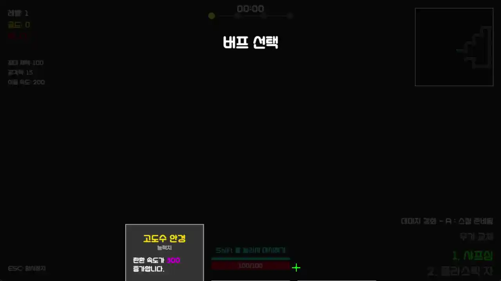
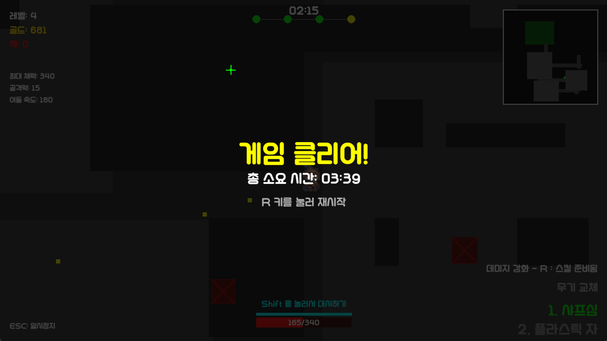

#  University Dungeon




<p align="center">
    컴공이는 과제, 팀플, 시험의 던전에서 벗어나 무사히 졸업할 수 있을까요?<br>
    다양한 무기와 전공 버프를 활용해 대학 던전을 탈출하는 로그라이크 슈팅 게임입니다.
</p>

---
## Before run
pip install -r requirements.txt

## 프로젝트 구조

```text
project
├── main.py               # 게임 엔트리 포인트
├── engine.py             # 핵심 게임 엔진
├── dungeon.py            # 던전 생성 및 관리
├── entities.py           # 플레이어 및 몬스터 객체
├── buff_system.py        # 버프/디버프 시스템
├── shop_system.py        # 상점 시스템
├── ui.py                 # UI 메인
├── ui_slider_temp.py     # 슬라이더 UI 컴포넌트
├── assets.py             # 이미지/음향 리소스 로드
└── i18n.py               # 텍스트
````

## Credits & Licenses
- 긱블 말랑이체
- General Sound Effects - freesound_community via Pixabay
- Martial Arts Fast Punch - Mixkit
- Evil Bodega - Adam MacDougall

---

## Demo
https://github.com/user-attachments/assets/626da2ef-c1c6-450f-89e2-b32f3bf94d2a

<br>
Clear
<br>

